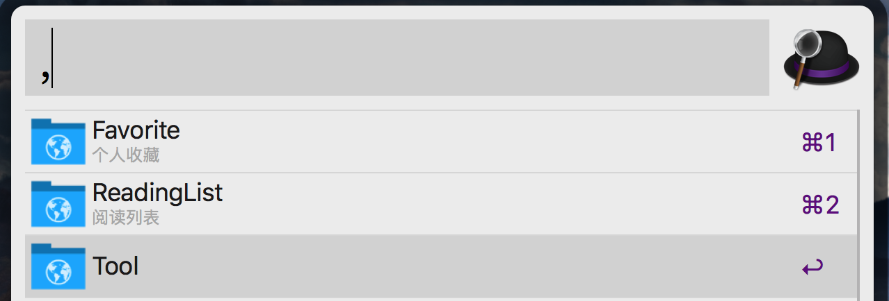
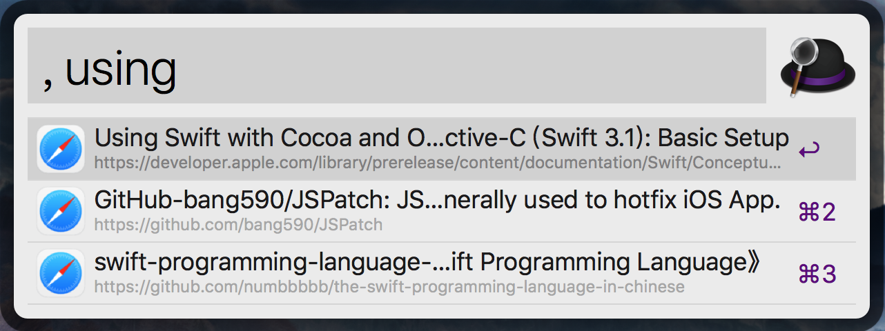
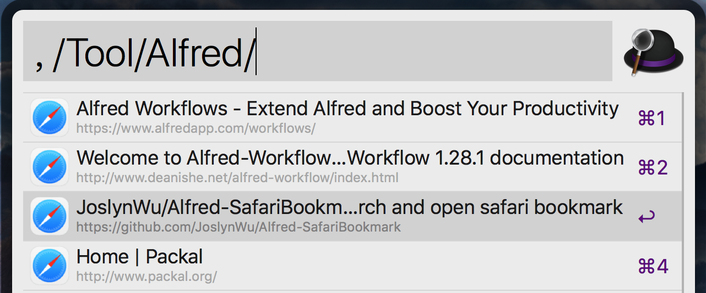

# Alfred-SafariBookmark

Fuzzy search or search by folder for bookmark

## [中文介绍](#中文介绍)

## Feature

- Fuzzy search all bookmark
- bookmark search by folder
- Easy to copy url
- Fast open url

## Design

**1、List top level directory**

 

**2、Fuzzy search**

 

**3、Search by folder**

## Require

- Installed with [Alfred](https://www.alfredapp.com) software

## Usage
1. Download [.alfredworkflow](https://github.com/JoslynWu/Alfred-SafariBookmark/blob/master/Safari%20bookmark.alfredworkflow) file.
2. Double click `Safari bookmark.alfredworkflow`. 
3. Start-up Alfred and Input keyword(default <kbd>,</kbd>).
4. Select a folder enter the next level.
5. Select a bookmark open a web with Safari.

## Keybinding

| **key** | **bookmark** | **folder** |
|:--|:--|:--|
| <kbd>Enter</kbd> | open url | enter folder |
| <kbd>⌘ + Enter</kbd> /<kbd>⌘ + C</kbd> | copy url | - |
| <kbd>⌘ + Y</kbd> | quick look for url | - |
| <kbd>⌘ + L</kbd> | large text for url | large text for folder name |
| <kbd>Tab</kbd> | - | enter folder |

## Other

1. When you fuzzy search, you should follow keyword(default <kbd>,</kbd>) with a space.
2. When you want to search folder by keyboard, must start with `/`.
3. Input `, workflow:update` to update this workflow, if have higher version.

## License

Apache License 2.0

***********

# 中文介绍

模糊搜索或者按文件夹搜索书签

## 主要功能

- 模糊搜索书签
- 按文件夹搜索书签
- 便捷复制链接
- 快速打开链接

## 样图展示

见 [Design](#design)

## 要求

- 需要安装[Alfred](https://www.alfredapp.com) 软件。

## 使用说明

1. 下载 [.alfredworkflow](https://github.com/JoslynWu/Alfred-SafariBookmark/blob/master/Safari%20bookmark.alfredworkflow) 文件。
1. 双击 `Safari bookmark.alfredworkflow`文件。
2. 启动Alfred，键入关键字（默认为<kbd>,</kbd>）。
3. 点击文件夹进入下一级。
4. 点击书签打开网页。

## 快捷键

| **快捷键** | **书签** | **书签文件夹** |
|:--|:--|:--|
| <kbd>Enter</kbd> | 打开连接 | 进入下一级文件夹 |
| <kbd>⌘ + Enter</kbd> /<kbd>⌘ + C</kbd> | 复制链接 | - |
| <kbd>⌘ + Y</kbd> | 快速预览页面 | - |
| <kbd>⌘ + L</kbd> | 放大显示链接 | 放大显示文件夹名 |
| <kbd>Tab</kbd> | - | 补全文件夹名并进入下一级 |

## 其它

1. 在使用模糊搜索时，需要在关键字（默认为<kbd>,</kbd>）后加一个空格。
2. 当需要搜索文件夹（仅支持同级文件夹）时，需要以`/`开头。
3. 输入`, workflow:update`可以更新该workflow，如果有更高版本。

## 许可证

Apache License 2.0
